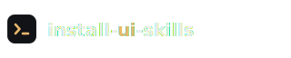

# skills-install

Instala de una sola vez un set curado de **~20 skills** de UI, accesibilidad, motion y
frontend para agentes de código (Claude Code, Cursor, Codex, etc.). Un comando, nada
permanente: las skills se bajan a `~/.claude/skills` y tu agente las usa solo cuando aplican.

Internamente usa el CLI [`skills`](https://skills.sh) (Node), así que necesitás **Node** o **Bun** instalado.

## Instalación

**macOS · Linux**

```bash
curl -fsSL https://raw.githubusercontent.com/juampymdd/skills-install/main/install-ui-skills.sh | bash
```

**Windows (PowerShell)**

```powershell
irm https://raw.githubusercontent.com/juampymdd/skills-install/main/install-ui-skills.ps1 | iex
```

**Con npx (Node)**

```bash
npx github:juampymdd/skills-install
```

**Con bunx (Bun)**

```bash
bunx github:juampymdd/skills-install
```

## Qué instala

| Skill | Repo |
| --- | --- |
| baseline-ui | ibelick/ui-skills |
| fixing-accessibility | ibelick/ui-skills |
| fixing-motion-performance | ibelick/ui-skills |
| frontend-design | anthropics/skills |
| wcag-audit-patterns | wshobson/agents |
| emil-design-eng | emilkowalski/skill |
| react-doctor | millionco/react-doctor |
| shadcn | shadcn-ui/ui |
| make-interfaces-feel-better | jakubkrehel/make-interfaces-feel-better |
| design-lab | 0xdesign/design-plugin |
| ui-ux-pro-max | nextlevelbuilder/ui-ux-pro-max-skill |
| interface-design | Dammyjay93/interface-design |
| 12-principles-of-animation | raphaelsalaja/skill |
| impeccable | pbakaus/impeccable |
| bencium-innovative-ux-designer | bencium/bencium-marketplace |
| gpt-taste | Leonxlnx/taste-skill |
| vercel-react-best-practices | vercel-labs/agent-skills |
| agent-browser | vercel-labs/agent-browser |
| web-design-guidelines | vercel-labs/agent-skills |
| brainstorming | obra/superpowers |

## Global vs por proyecto

Por defecto instala **global** (`~/.claude/skills`), disponible en todos tus proyectos.

Para instalar **en el proyecto actual** (`<cwd>/.claude/skills`, solo ese repo): primero
`cd` a la carpeta del proyecto, y pasá el flag `--project` (PowerShell: `-Project`).

> Importante: el destino es el directorio donde corrés el comando. Si lo corrés parado en
> tu home, `<cwd>/.claude/skills` coincide con la ruta global y "parece" global. `cd` al
> proyecto primero. El script imprime `Destino: ...` antes de instalar — verificá esa línea.

**Windows (PowerShell)**

```powershell
cd C:\ruta\al\proyecto
& ([scriptblock]::Create((irm https://raw.githubusercontent.com/juampymdd/skills-install/main/install-ui-skills.ps1))) -Project
```

**macOS · Linux**

```bash
cd /ruta/al/proyecto
curl -fsSL https://raw.githubusercontent.com/juampymdd/skills-install/main/install-ui-skills.sh | bash -s -- --project
```

**npx / bunx** (desde la carpeta del proyecto)

```bash
npx github:juampymdd/skills-install --project
bunx github:juampymdd/skills-install --project
```

(También funciona la variable de entorno `PROJECT=1` / `$env:PROJECT="1"` como alternativa.)

## Otro agente

Los scripts instalan en `claude-code` por defecto. Editá la variable `AGENT` (o `$Agent`)
en `install-ui-skills.sh` / `install-ui-skills.ps1` / `bin/install.mjs` para apuntar a
`cursor`, `codex`, `gemini-cli`, etc.

## Landing

`index.html` es una landing autocontenida (Tailwind por CDN, sin build) para el proyecto.
